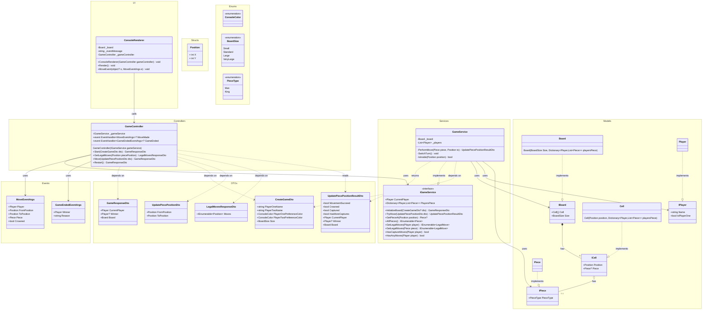

```mermaid
classDiagram
    namespace UI {
        class ConsoleRenderer {
            -Board _board
            -string _eventMessage
            -GameController _gameController
            +ConsoleRenderer(GameController gameController) void
            +Render() void
            +MoveEvent(object? o, MoveEventArgs e) void
        }
    }

    namespace DTOs {
        class GameResponseDto {
            +Player CurrentPlayer
            +Player? Winner
            +Board Board 
        }

        class CreateGameDto {
            +string PlayerOneName
            +string PlayerTwoName
            +ConsoleColor PlayerOnePreferenceColor
            +ConsoleColor PlayerTwoPreferenceColor
            +BoardSize Size
        }

        class UpdatePiecePositionDto {
            +Position FromPosition
            +Position ToPosition
        }

        class LegalMovesResponseDto {
            +IEnumerable~Position~ Moves
        }

        class UpdatePiecePositionResultDto {
            +bool MovementSucceed
            +bool Crowned
            +bool Captured
            +bool HasMoreCaptures
            +Player CurrentPlayer
            +Player? Winner
            +Board Board 
        }
    }

    namespace Controllers {
        class GameController {
            -IGameService _gameService
            +event EventHandler~MoveEventArgs~? MoveMade
            +event EventHandler~GameEndedEventArgs~? GameEnded
            GameController(IGameService gameService)
            +Start(CreateGameDto dto) GameResponseDto
            +GetLegalMoves(Position piecePosition) LegalMovesResponseDto
            +Move(UpdatePiecePositionDto dto) GameResponseDto
            +Restart() GameResponseDto
        }
    }
    
    namespace Services {
        class IGameService {
            <<interface>>
            +Player CurrentPlayer
            +Dictionary~Player#44;List~Piece~~ PlayersPiece
            +InitializeBoard(CreateGameDto? dto) GameResponseDto
            +TryMove(UpdatePiecePositionDto dto) UpdatePiecePositionResultDto
            +GetPieceAt(Position position) Piece?
            +AllPieces() IEnumerable~Piece~
            +GetLegalMoves(Player player) IEnumerable~LegalMove~
            +GetLegalMoves(Piece piece) IEnumerable~LegalMove~
            +HasCaptureMoves(Player player) bool
            +HasAnyMoves(Player player) bool
        }

        class GameService {
            -Board _board
            -List~Player~ _players
            -PerformMove(Piece piece, Position to) UpdatePiecePositionResultDto
            -SwitchTurn() void
            -IsInside(Position position) bool
        }
    }
    
    namespace Models {
        class Board {

            Board(BoardSize Size, Dictionary~Player#44;List~Piece~~ playersPiece)
        }

        class IBoard {
            +Cell[,] Cell 
            +BoardSize Size            
        }

        class Cell {

            Cell(Position position, Dictionary~Player#44;List~Piece~~ playersPiece)
        }

        class ICell {
            +Position Position
            +Piece? Piece
        }

        class Piece {

        }

        class IPiece {
            +PieceType PieceType
        }

        class Player {

        }

        class IPlayer {
            +string Name
            +bool IsPlayerOne
        }
    }

    namespace Structs {
        class Position{
            + int X
            + int Y
        }
    }

    namespace Events {
        class MoveEventArgs {
            +Player Player
            +Position FromPosition
            +Position ToPosition
            +Piece Piece
            +bool Crowned
        }

        class GameEndedEventArgs {
            +Player Winner
            +string Reason
        }
    }

    namespace Enums {
        class ConsoleColor {
            <<enumeration>>
        }

        class BoardSize {
            <<enumeration>>
            Small
            Standard
            Large
            VeryLarge
        }

        class PieceType {
            <<enumeration>>
            Man
            King
        }
    }

    ConsoleRenderer --> GameController : calls 
    GameController --> IGameService : uses
    GameController --> MoveEventArgs : uses
    GameController --> GameEndedEventArgs : uses
    GameController ..> GameResponseDto: depends on
    GameController ..> CreateGameDto: depends on
    GameController ..> UpdatePiecePositionDto: depends on
    GameController ..> LegalMovesResponseDto: depends on
    GameController ..> UpdatePiecePositionResultDto : reads
    GameService ..> UpdatePiecePositionResultDto : returns
    GameService ..|> IGameService: implements
    GameService ..> CreateGameDto: depends on
    GameService --> IBoard : uses
    GameService --> IPlayer : uses
    GameService --> IPiece : uses
    IBoard *-- "0..*" ICell: has
    ICell o-- "0..1" IPiece: has
    Board ..|> IBoard: implements
    Cell ..|> ICell: implements
    Piece ..|> IPiece: implements
    Player ..|> IPlayer: implements
```