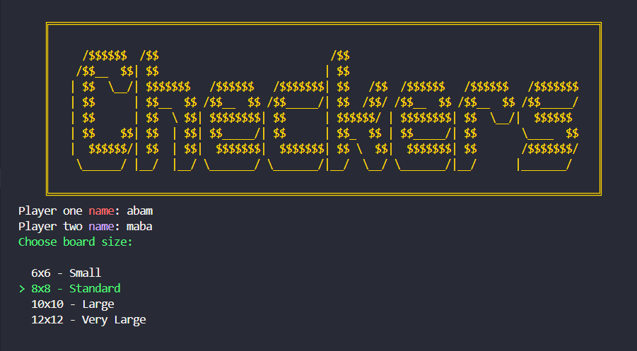
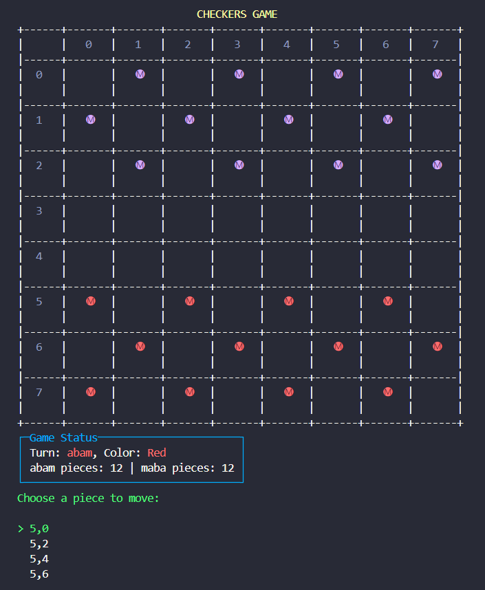
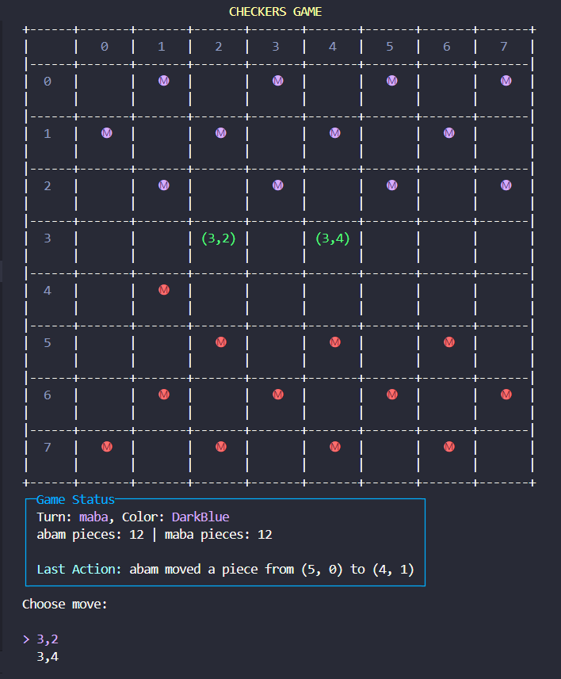
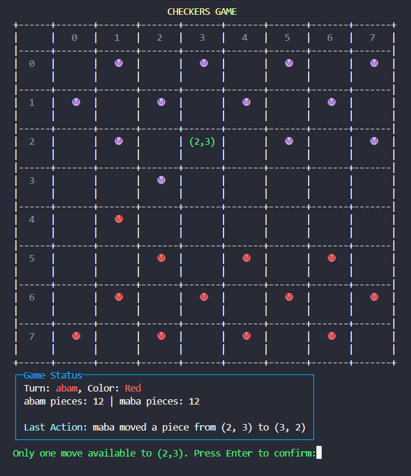
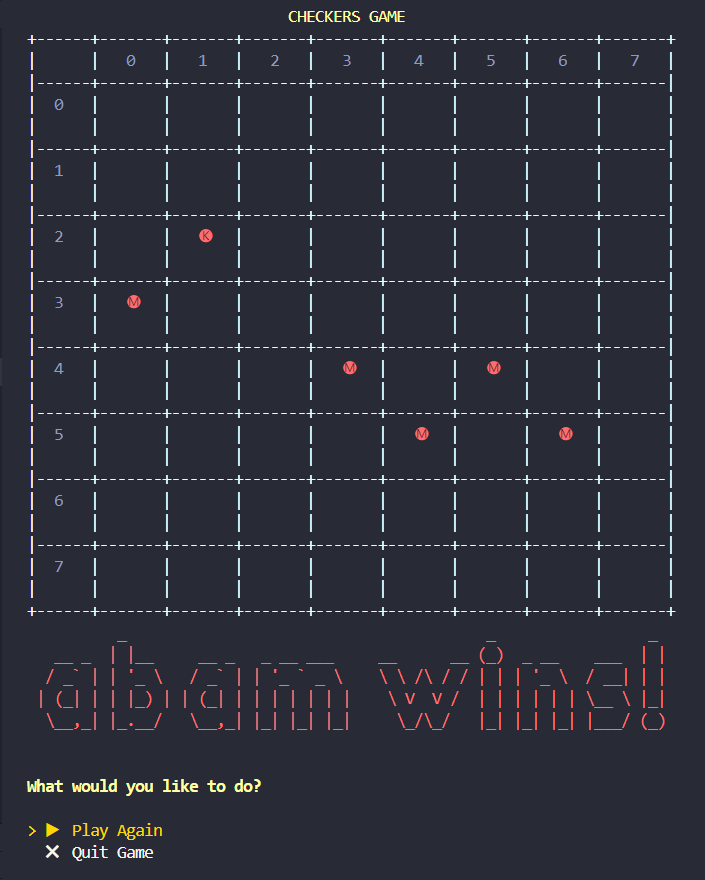

# Checkers Game - Console Edition

A fully-featured **two-player Checkers game** built with C# and .NET 8.0. Play the classic board game in your terminal with a beautiful console UI.

## Tech Stack

- **Language**: C# 12
- **Framework**: .NET 8.0
- **UI Library**: [Spectre.Console](https://spectreconsole.net/) v0.57.1
- **Architecture**: MVC (Model-View-Controller) Pattern
- **Build System**: .NET CLI

## Features

✅ **Two-Player Gameplay**

- Interactive console-based interface
- Turn-based gameplay system
- Support for multiple board sizes

✅ **Game Mechanics**

- Legal move validation and highlighting
- Piece capturing and removal
- King/Crown promotion for pieces reaching the opposite end
- Automatic turn management
- Win condition detection

✅ **Customization**

- Custom player names
- Custom player colors
- Multiple board size options (6x6, 8x8, 10x10, 12x12)

✅ **User Experience**

- Rich console UI with colors and styling via Spectre.Console
- Visual board representation
- Real-time game event notifications
- Game restart functionality
- Main menu system

## Getting Started

### Prerequisites

- .NET 8.0 SDK or later
- Windows, macOS, or Linux

### Installation

1. Clone the repository:

```bash
git clone <repository-url>
cd checkers-game
```

2. Navigate to the console project:

```bash
cd CheckersGameConsole
```

3. Build the project:

```bash
dotnet build
```

4. Run the game:

```bash
dotnet run
```

## How to Play

1. **Start the Game**: Run the application and it will show the main menu
2. **Customize Players**: Enter player names and select custom colors
3. **Choose Board Size**: Select your preferred board size
4. **Make Moves**:
   - Select a piece you want to move
   - View highlighted legal moves
   - Click or select a destination square
5. **Capture Pieces**: Move diagonally forward to capture opponent pieces
6. **Crown Your Pieces**: Reach the opposite end of the board to crown your piece as a king
7. **Win the Game**: Eliminate all opponent pieces or block all their possible moves

## Project Structure

```
CheckersGameConsole/
├── Models/              # Core game models (Board, Piece, Player, Position, Cell)
├── Services/            # GameService - core business logic
├── Controllers/         # GameController - handles game flow and events
├── Views/               # ConsoleRenderer - UI rendering
├── DTOs/                # Data Transfer Objects for game operations
├── Interfaces/          # Contracts for models and services
├── Enums/               # BoardSize, PieceType enumerations
├── Events/              # Custom event arguments
└── Assets/              # Game screenshots
```

## Screenshots

### Main Menu



### Start of Game



### Choosing a Move



### Capturing a Piece



### Player Wins



## Game Rules

- Pieces move diagonally forward only (until crowned)
- Pieces capture by jumping over opponent pieces diagonally
- Consecutive captures can be made in a single turn if available
- Pieces become kings when reaching the opposite end
- Kings can move diagonally in any direction
- The game ends when one player has no legal moves or all pieces are captured

## Architecture Highlights

### MVC Pattern

- **Model**: Board, Piece, Player, Position, Cell
- **View**: ConsoleRenderer for UI rendering
- **Controller**: GameController for game flow management

### Event-Driven Design

- `MoveEventArgs`: Handles move notifications
- `GameEndedEventArgs`: Handles game completion

### Service Layer

- `IGameService` interface for game operations
- `GameService` implementation with move validation and game state management

## Future Enhancements

- AI opponent
- Game replay/move history
- Score tracking
- Network multiplayer
- Settings customization

## Author

[Abam](https://abams-folio.netlify.app)
